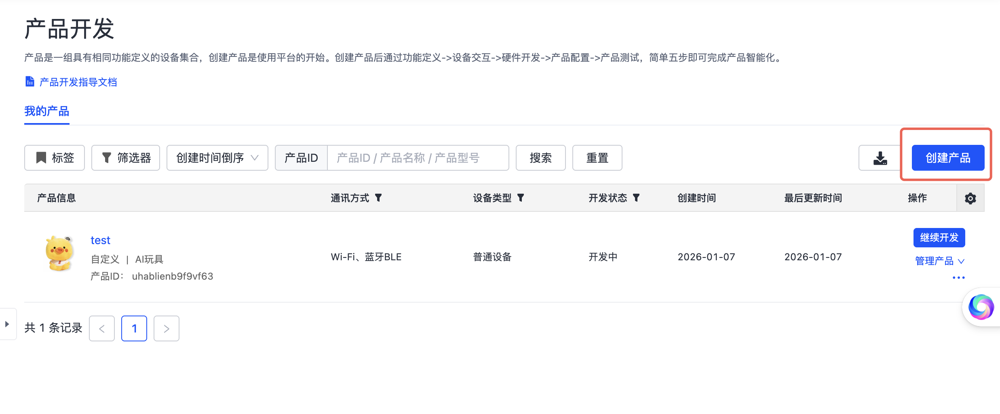
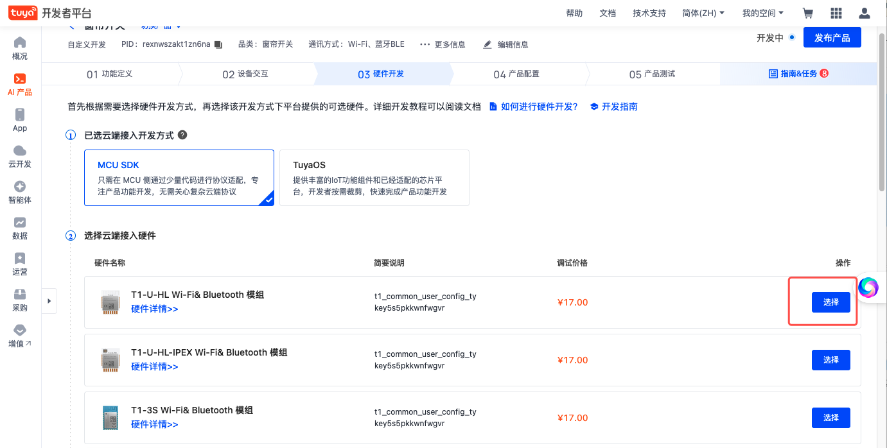
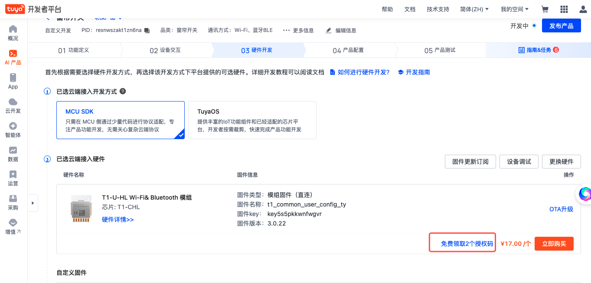
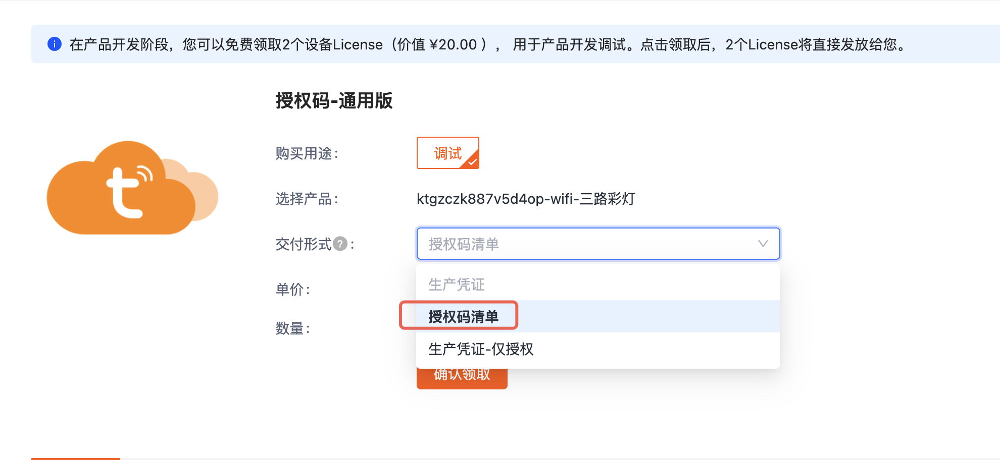
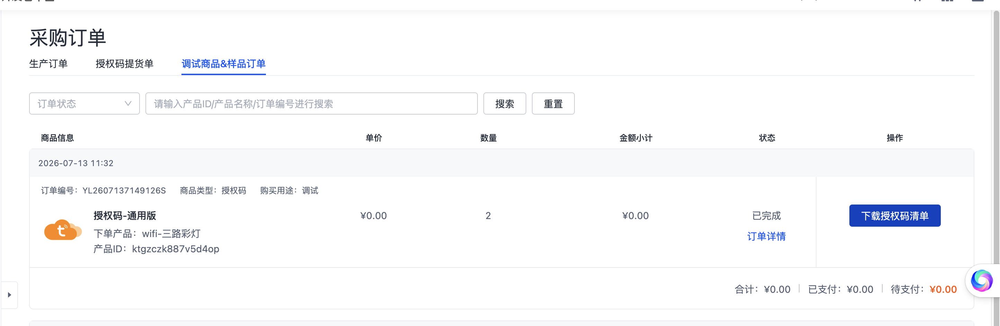

# 领取授权码

涂鸦为每个产品提供 **2 个免费的开发者授权码**，用于设备激活和调试。无需购买模组即可获取。

## 步骤

### 1. 创建产品

登录 [涂鸦 IoT 平台](https://iot.tuya.com)，进入**产品开发**，点击**创建产品**。

选择品类后完成基本信息填写：

### 2. 选择模组

在硬件类型页面中，**选择任意一个模组**。

:::tip
必须选择模组后，页面才会出现"领取授权码"的入口链接。
:::

### 3. 领取授权码

选择模组后，页面上方会出现**免费领取 2 个激活码**的链接，点击链接。

在这个选择页面, 交付形式选择"授权码清单"。

流程完成后, 在采购订单的"调试商品&样品订单" 页面进行授权码清单的下载。

## 下一步

- [创建 AI Agent](./guides/create-agent.md) — 配置产品的 AI 能力
- [快速开始](./tutorials/quick-start.md) — 编译并运行第一个示例
