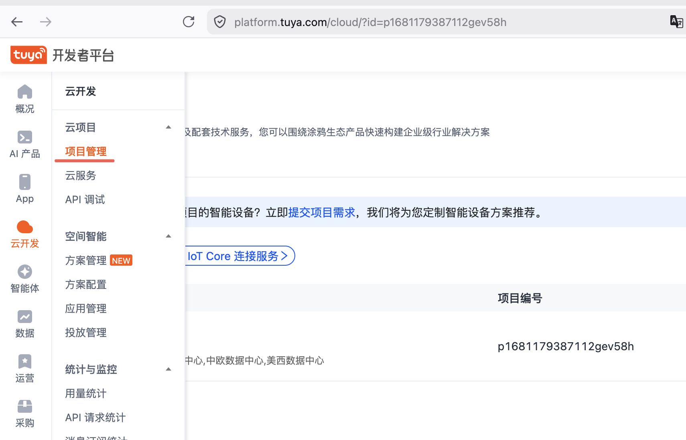
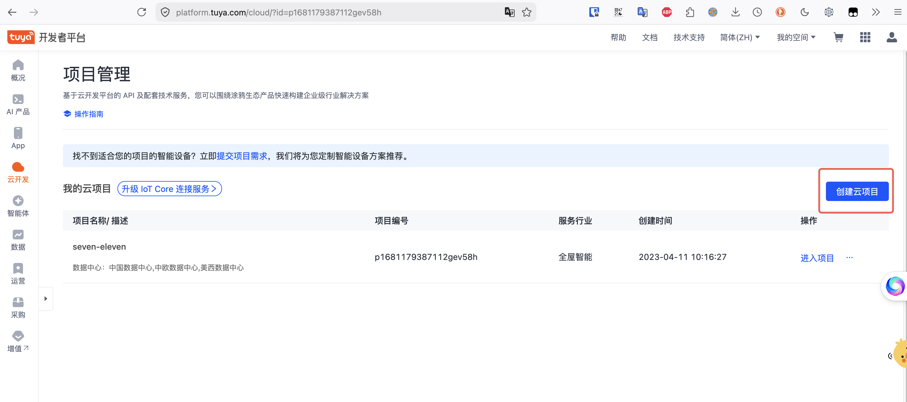
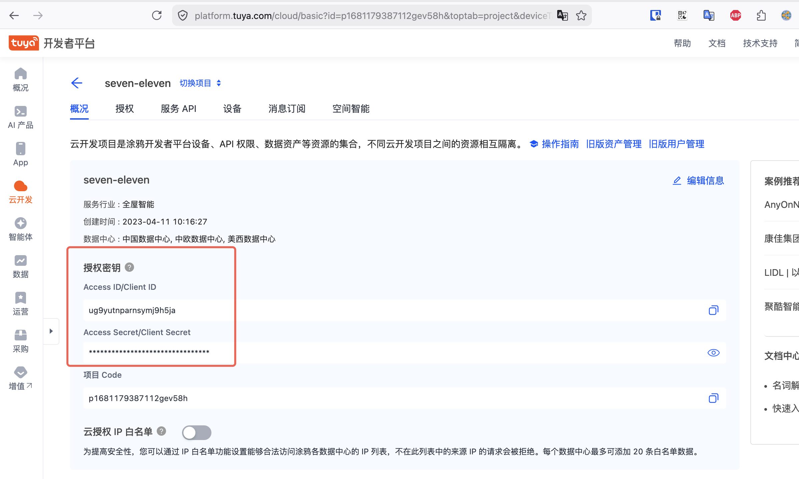
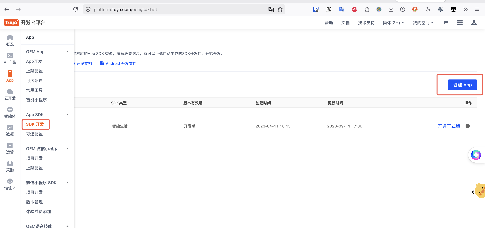
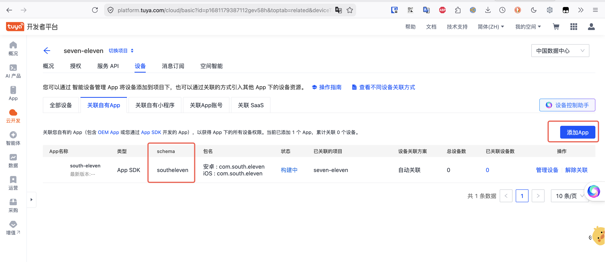

# 创建 App 和云项目

本文档介绍如何在涂鸦开发者平台创建云项目并获取 OpenAPI 配网所需的 `client-id`、`client-secret` 和 App `schema` 参数。

:::tip
更多详细信息请参考涂鸦官方文档：[配置云项目](https://developer.tuya.com/cn/docs/iot/config-ify-cloud-project?id=Ka4czp6p5fh3c)
:::

## 1. 进入云项目管理

登录 [涂鸦 IoT 开发平台](https://iot.tuya.com/)，在左侧导航栏找到 **云开发** 入口，进入云项目管理页面。



## 2. 创建云项目

点击 **创建云项目**，填写项目名称等信息，选择数据中心（根据设备部署区域选择对应的数据中心），完成创建。



## 3. 获取 Client ID 和 Client Secret

云项目创建完成后，在项目概览页面可以看到 **Access ID**（即 `client-id`）和 **Access Secret**（即 `client-secret`）。这两个参数用于调用涂鸦 OpenAPI 时进行身份认证。



将这两个值分别配置为环境变量：

```bash
export TUYA_CLIENT_ID="你的 Access ID"
export TUYA_CLIENT_SECRET="你的 Access Secret"
```

## 4. 创建 App

在涂鸦 IoT 平台中创建一个 App，获取其 **schema** 标识。App 用于用户管理 —— 通过 OpenAPI 配网时，需要在 App 下创建和管理用户，实现不同 App 之间的用户隔离。


:::tip
这里创建的App是为了获取 schema 参数来做不同客户的用户隔离, 可以不创建真实
的 App 和上架 App 商城。如果客户想要 集成 Tuya App SDK, 也可以复用这里的设
置。
:::

App 的 schema 即为配网脚本中使用的 `SCHEMA` 参数。



```bash
export SCHEMA="你的 App Schema"
```

## 5. 将 App 关联到云项目

创建 App 后，需要将其关联到云项目中，这样通过云项目的 API 才能操作该 App 下的用户和设备。在云项目设置中找到关联应用，将刚创建的 App 添加进来。



## 下一步

完成以上步骤后，你将拥有以下环境变量所需的值：

| 环境变量 | 来源 |
|----------|------|
| `TUYA_CLIENT_ID` | 云项目的 Access ID |
| `TUYA_CLIENT_SECRET` | 云项目的 Access Secret |
| `TUYA_BASE_URL` | 根据数据中心选择，如 `https://openapi.tuyacn.com` |
| `SCHEMA` | App 的 schema 标识 |

配置好这些参数后，即可按照 [OpenAPI 配网](../tutorials/openapi-activate.md) 教程完成设备激活。
