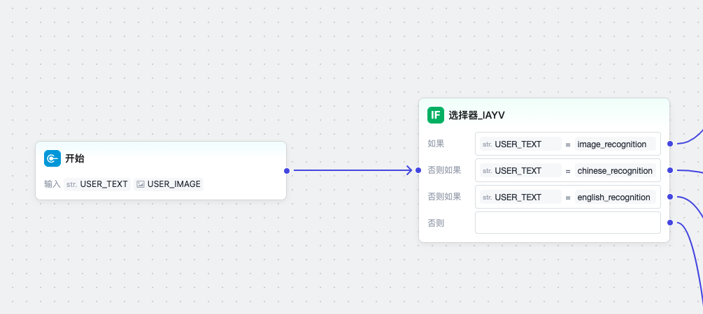
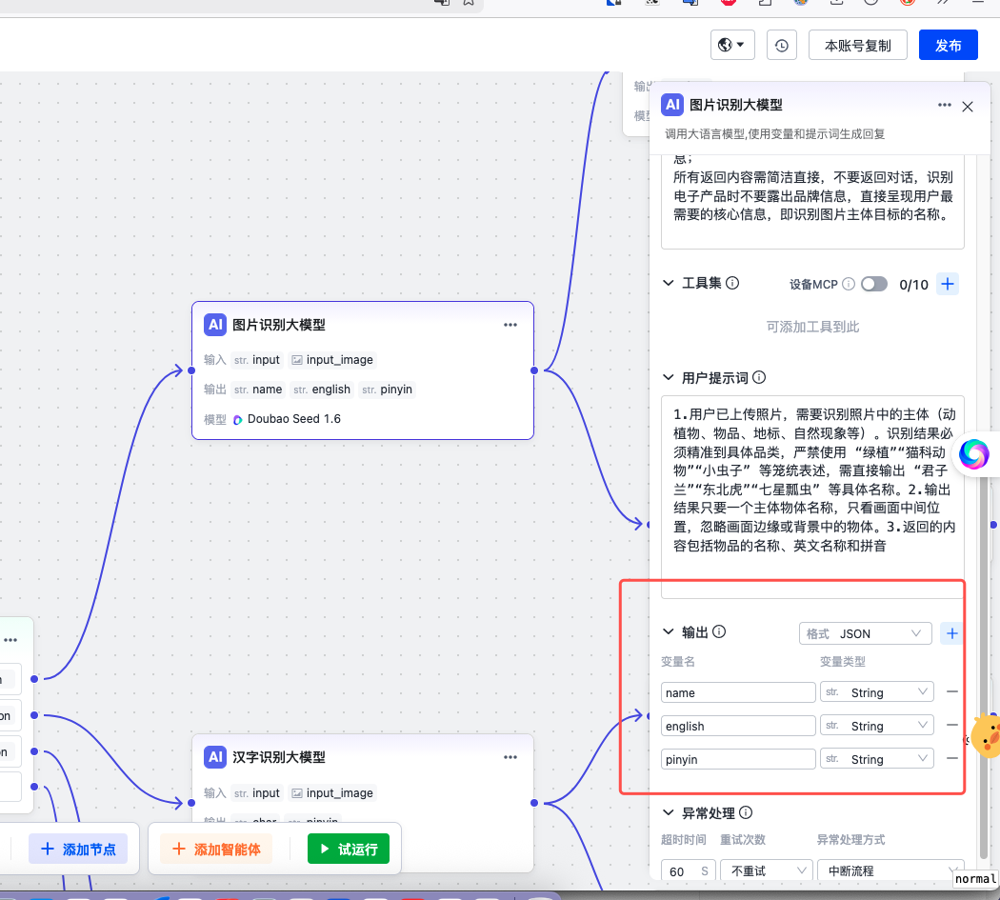
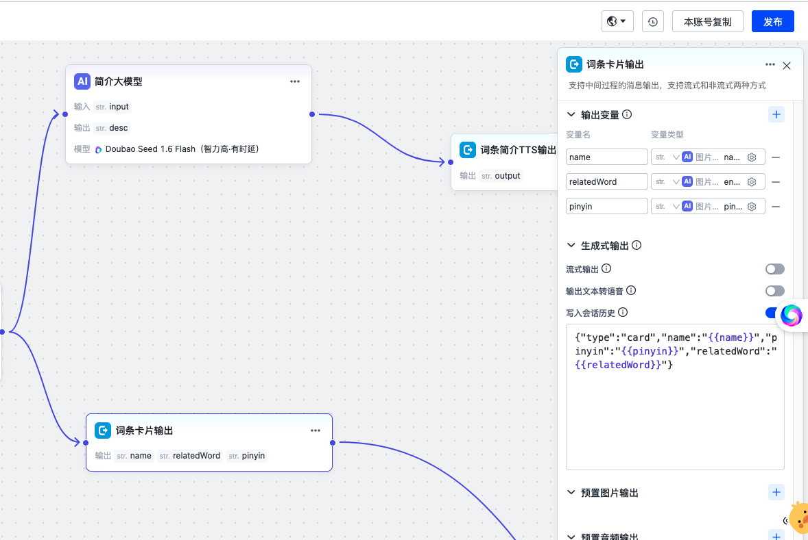

# 创建工作流

:::note
阅读此文前请先了解 Agent 配置相关概念。可以阅读 [创建 Agent](https://developer.tuya.com/cn/docs/iot/ai-agent-management?id=Kdxr4v7uv4fud)
:::

默认的 Agent 配置主要是用于语音聊天场景的，如果需要实现其他的功能场景，
比如图片理解、或者以文生图等，需要在 Tuya 平台上以`工作流`方式配置 Agent 以实
现。下面以配置一个 **拍学机** 的 Agent 为例，来说明如何配置工作流以实现功能。

一般 **拍学机** 的主要功能场景是：用户按一下拍照按钮，然后拍学机屏幕会显示关于
检测到的物体的相关信息，包括拼音/名称/英文/介绍等，这部分信息是 **结构化** 的，
但字段可能每个拍学机的厂商是不同的。为实现此功能，我们需要创建一个工作流，
然后输出一个 `json`，json 里有我们需要的字段。

## 配置工作流

当我们创建工作流的时候，画布上已经有了开始和结束节点，其中开始节点有
`USER_TEXT` 和 `USER_IMAGE`，其中 `USER_TEXT` 代表用户的文本输入，可以是在 SDK
里以 text 类型的消息传，也可以是 audio 消息传上来之后云端 ASR 识别后的文本。

我们在这里加一个选择器，让它走到不同的流程（考虑到中英文等不同多语言场景）。




然后我们配置一个多模态大模型节点，用于做图片识别。配置好提示词、输入（包括
文本和图片）以及输出，这里需要输出 `json` 格式。



大模型输出的 json 会走两个分支:

一个分支直接输出给设备端（卡片输出），这样设备端可以提取 json 里的字段来渲染
到屏幕上。



另一个分支再走一次大模型来生成一段文字描述（TTS 输出），然后这段文字描述会
输出给设备端做 TTS 播报。

## 工作流典型结构

```text
开始（USER_TEXT + USER_IMAGE）
    ├─ 选择器：根据 prompt 文本匹配分支
    ├─ 多模态大模型节点：图片识别，输出 JSON
    ├─ 卡片输出分支：将 JSON 直接输出给设备端
    ├─ TTS 输出分支：用大模型生成描述文本，再做 TTS
    └─ 结束
```

## 代码开发

```c
//和工作流配置值对应的固定串
const char *prompt     =  "image_recognition";
...
//发送 prompt text，用于触发工作流
stm_ret ret = send_text_prompt(session, "img_understand_001", prompt, 0);
...
//发送图片，fin 标志改为 1，表示结束发包
ret = send_image(session, NULL, img_data, nread, img_format, 1);
..
//处理回调事件，处理收到的 text 包里的 json
```

当程序跑出来后，这个请求会产生两个输出：一个 json 格式的结构化数据，一个文本
串（描述对应物体的）。

```
数据发送完毕
等待 AI 响应...
[Text] {"bizId":"img_understand_001","bizType":"NLG","eof":0,"data":{"content":
  "{\"type\":\"card\",\"name\":\"谷歌浏览器图标\",\"pinyin\":\"gu ge liu lan qi tu biao\",
  \"relatedWord\":\"Google Chrome Icon\"}",...}}

[Text] {"bizId":"img_understand_001","bizType":"NLG","eof":0,"data":{"content":
  "谷歌浏览器（Google Chrome）是谷歌公司开发的一款全球流行的网页浏览器...",...}}

[Text] {"bizId":"img_understand_001","bizType":"NLG","eof":1,"data":{"content":"",
  "finish":true,...}}
```

## 相关链接

- [如何创建 Agent](./create-agent) — Agent 基础配置步骤
- [图片理解教程](../tutorials/edu-camera) — 设备端发送图片的完整示例
