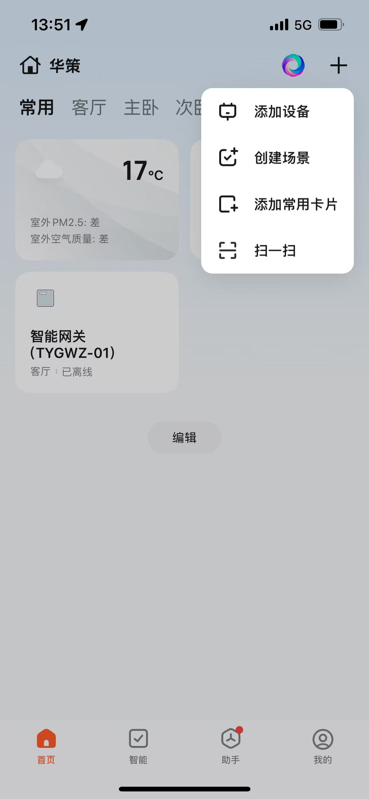
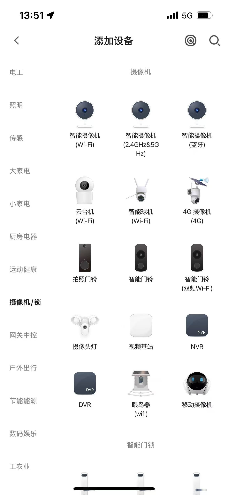
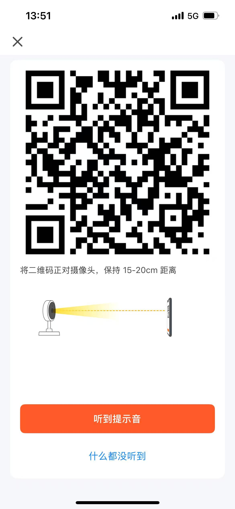

# 设备扫码配网

> 对应示例：`examples/posix/pair/scan-by-device/`

本章介绍如何通过扫描涂鸦 App 生成的二维码，完成设备的配网激活流程。

使用这种配网方式时，需要设备带摄像头功能，可以扫描 App 生成的二维码，如果设
备没有摄像头硬件，则无法使用此配网方式。

涂鸦 App 在配网流程中会生成一个包含 Wi-Fi 凭据和激活 Token 的二维码，设备
端用摄像头扫描该二维码即可完成免手动输入的自动激活。

激活成功后，云端会为设备分配 `devid`、`secret_key`、`local_key`，后续使用
`iot_client_init()` 以及 AI SDK 接口时均需使用这三个字段。

## App 侧操作流程

**第一步：** 在涂鸦 App 首页点击右上角 **"+"**，选择 **"添加设备"**。



**第二步：** 在设备类别列表中选择对应的产品品类（例如：摄像机 → 智能摄像机
Wi-Fi）。



**第三步：** App 显示配网二维码，提示用户将二维码对准设备摄像头，保持
15-20cm 距离，等待设备发出提示音。



二维码内容是一段固定格式的 JSON 字符串：

```json
{"s":"<SSID>","p":"<password>","t":"<token>"}
```

其中：

| 字段 | 说明 |
|------|------|
| `s`  | Wi-Fi SSID |
| `p`  | Wi-Fi 密码 |
| `t`  | 涂鸦云激活 Token（前两字符编码 Region） |

## 设备侧实现流程

```
stbi_load(jpg_path)                          // 1. 解码 JPEG -> 灰度像素缓冲
        |
        v
quirc_resize / quirc_begin / quirc_end       // 2. quirc 定位并解码二维码
quirc_decode()
        |
        v
json_get_str("s") / ("p") / ("t")           // 3. 解析 JSON，提取 SSID / 密码 / Token
        |
        v
iot_client_init_on_boarding_with_token()     // 4. 用 Token 激活设备，获得 devid 等凭据
        |
        v
iot_client_get_session_token()               // 5. 验证云端连通性，获取 AI 会话令牌
        |
        v
iot_client_deinit()                          // 6. 清理资源
```

## 关键 API

### `iot_client_init_on_boarding_with_token()`

```c
iot_client_t *iot_client_init_on_boarding_with_token(
    const iot_on_boarding_config_t *config,
    const char *token);
```

跳过 MQTT 等待，直接使用已知 Token 发起激活请求。Region 由 Token 前两字符自动
推导，无需手动指定。

**`iot_on_boarding_config_t` 主要字段：**

| 字段 | 说明 |
|------|------|
| `uuid` | 设备 UUID（从涂鸦 IoT 平台申请的授权码） |
| `authkey` | 设备 Auth Key |
| `product_key` | 产品 PID |
| `firmware_key` | 固件 Key（可为空） |
| `timeout_ms` | 激活超时时间（毫秒） |
| `env` | 环境：`PROD` / `PRE` |

**返回值：** 成功返回 `iot_client_t *`，其中包含激活后的 `devid`、
`secret_key`、`local_key`，后续可直接用于初始化 `iot_client_init()`；失败返
回 `NULL`。

## 运行示例

```sh
# 使用默认参数（代码内置的测试授权码 + res/qr.jpg）
./build/scan_by_device_pair_demo

# 指定参数
./build/scan_by_device_pair_demo ./res/qr.jpg <uuid> <authkey> <product_key> <firmware_key>
```

> **注意：** 请在 `examples/posix/` 目录下运行，默认路径 `res/qr.jpg` 才能正确解析。
> 测试资源文件位于 `examples/posix/res/` 目录中。

成功输出示例：

```
=== pair example ===
QR image     : res/qr.jpg
UUID         : tuyaXXXXXXXXXXXX
Product key  : p891xbkosae0dgda

[pair] Image loaded: qr.jpg (400x400)
[pair] QR payload: {"s":"MyWiFi","p":"password123","t":"AY..."}
[pair] SSID    : MyWiFi
[pair] Password: password123
[pair] Token   : AY...
[pair] Starting on-boarding with token...
[pair] Activation successful!
[pair] devid      : <device_id>
[pair] secret_key : <secret_key>
[pair] local_key  : <local_key>
[pair] Session token acquired (len=1234)
```

激活成功后，请将输出的 `devid`、`secret_key`、`local_key` 保存到设备持久化
存储中，后续通过 `iot_client_init()` 直接使用，无需重复配网。

## 注意事项

- 本示例使用 `stb_image` 从文件加载图片，实际产品中替换为摄像头实时帧
  即可，只需将像素数据写入 `quirc_begin()` 返回的缓冲区。
- Token 具有时效性，App 显示二维码后需在有效期内完成扫码激活。
- `firmware_key` 在大多数场景下可传空字符串。
