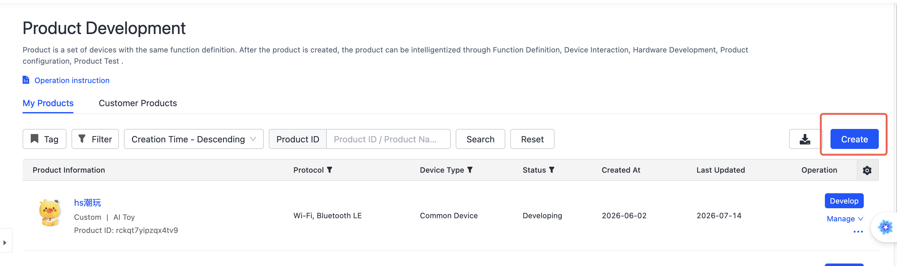
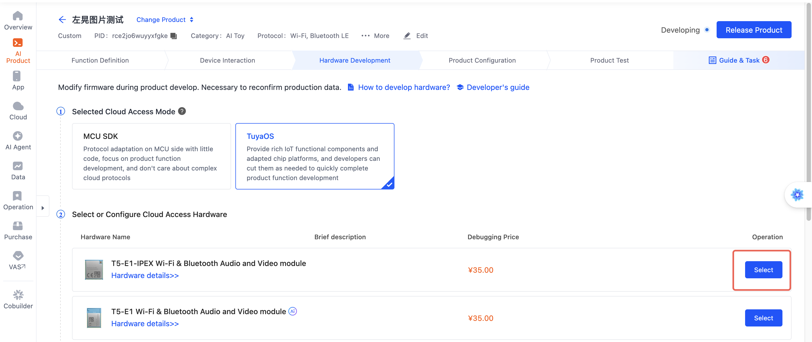
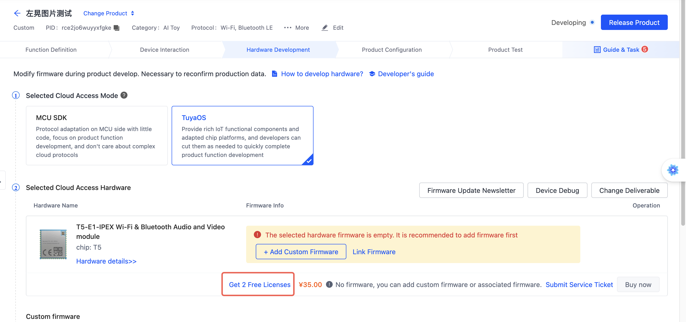
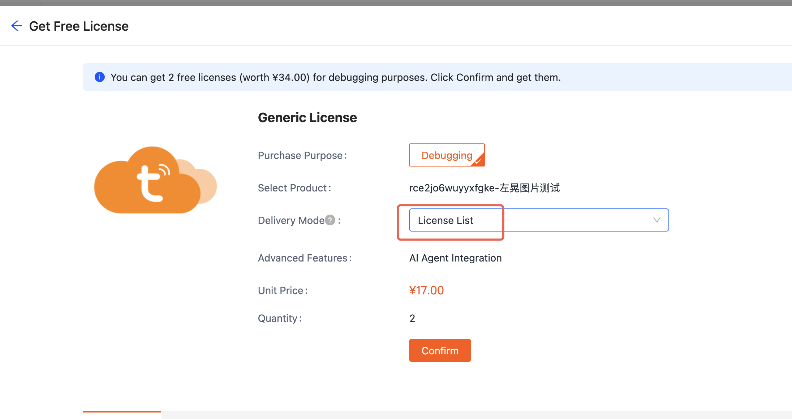
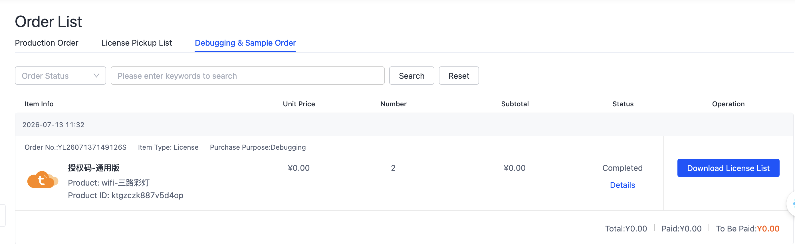

# Obtain Authorization Codes

Tuya provides **2 free developer authorization codes** for each product for device Activation and debugging. You can obtain them without purchasing a module.

## Steps {#步骤}

### 1. Create a product {#1-创建产品}

Sign in to the [Tuya IoT Platform](https://iot.tuya.com), go to **Product Development**, and click **Create Product**.

Select a category and enter the basic information:

*The figures in this sequence are schematic guides, not screenshots. They summarize the source platform actions; current English UI labels and account eligibility have not been verified.*

### 2. Select a module {#2-选择模组}

On the hardware type page, **select any module**.

:::tip
You must select a module before the "Claim Authorization Codes" entry link appears on the page.
:::

### 3. Claim authorization codes {#3-领取授权码}

After selecting a module, the **Claim 2 Activation Codes for Free** link appears at the top of the page. Click the link.

On the selection page, choose "Authorization Code List" as the delivery format.

After completing the process, download the authorization code list from the "Debugging Products & Sample Orders" page under purchase orders.

## Next steps {#下一步}

- [Create an AI Agent](./guides/create-agent.md) — Configure the product's AI capabilities
- [Quick start](./tutorials/quick-start.md) — Build and run the first example
