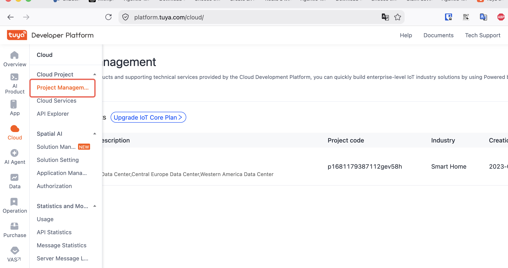
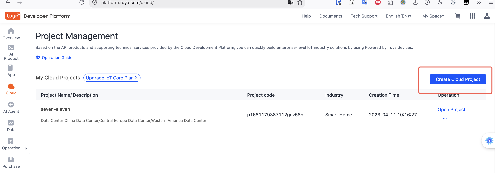
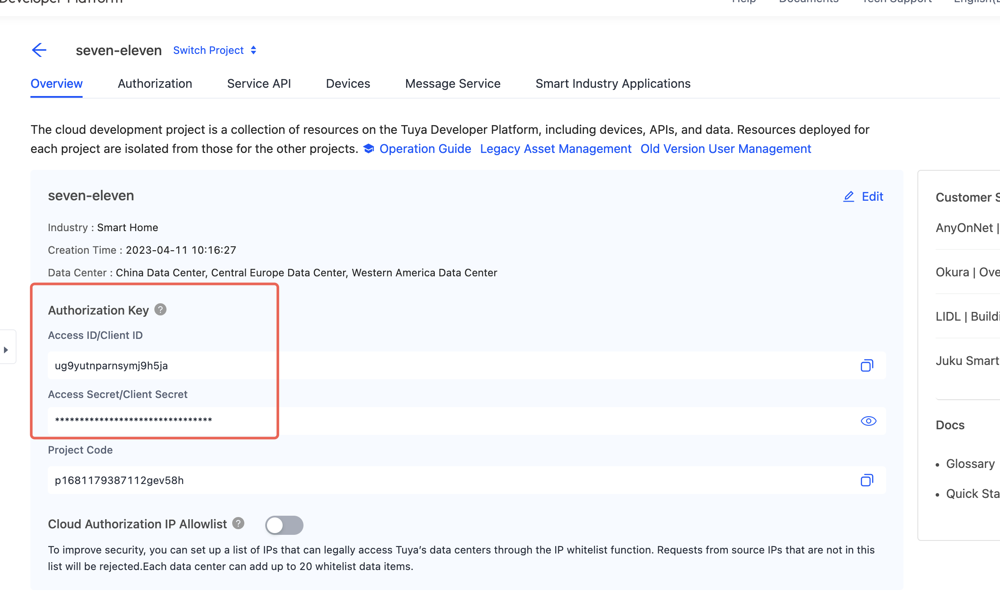
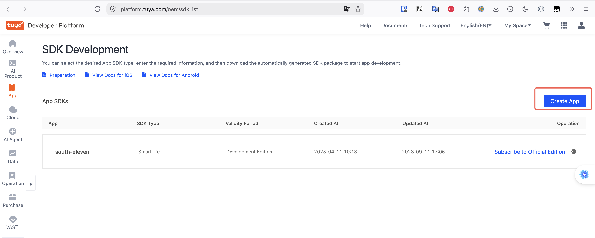
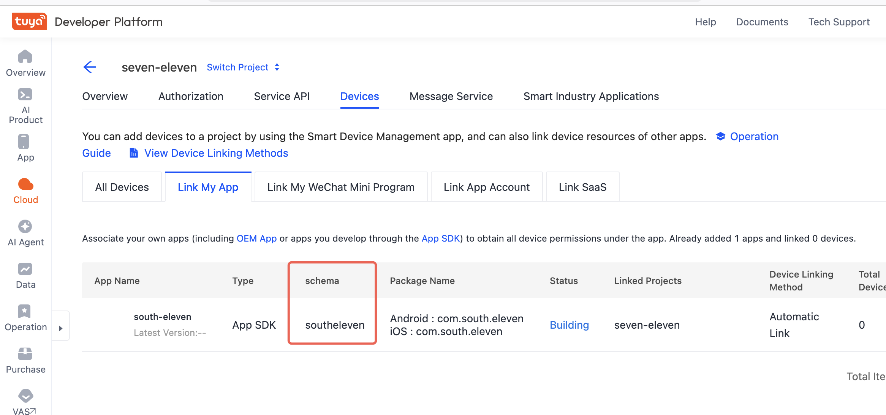

# Create an App and Cloud Project

This guide explains how to create a cloud project on the Tuya Developer Platform and obtain the `client-id`, `client-secret`, and App `schema` parameters required for OpenAPI provisioning.

:::tip
For more details, see the official Tuya documentation: [Configure Cloud Project](https://developer.tuya.com/en/docs/iot/config-cloud-project?id=Kat2eytbffx3v).
:::

## 1. Open Cloud Project Management {#1-进入云项目管理}

Log in to the [Tuya IoT Developer Platform](https://iot.tuya.com/), find **Cloud Development** in the left navigation pane, and open the cloud project management page.



*The figures in this sequence are schematic guides, not screenshots. Navigation labels are descriptive translations of the source UI, not verified current English labels. All account, project, App, and credential values are omitted.*

## 2. Create a Cloud Project {#2-创建云项目}

Click **Create Cloud Project**, enter the project name and other information, select the data center that corresponds to the region where your devices will be deployed, and complete creation.



## 3. Obtain the Client ID and Client Secret {#3-获取-client-id-和-client-secret}

After creating the cloud project, you can find the **Access ID** (`client-id`) and **Access Secret** (`client-secret`) on the project overview page. These two parameters authenticate calls to the Tuya OpenAPI.



Set these two values as environment variables. The Chinese placeholders below mean "your Access ID" and "your Access Secret"; replace them with your project's values:

```bash
export TUYA_CLIENT_ID="你的 Access ID"
export TUYA_CLIENT_SECRET="你的 Access Secret"
```

## 4. Create an App {#4-创建-app}

Create an App on the Tuya IoT Platform and obtain its **schema** identifier. The App is used for user management: when provisioning through OpenAPI, you create and manage users under an App to isolate users between different Apps.

:::tip
The purpose of creating the App here is to obtain the schema parameter for user isolation between customers. You do not need to build an actual App or publish it to an app store. If you plan to integrate the Tuya App SDK, you can reuse this setup.
:::

The App's schema is the `SCHEMA` parameter used in the provisioning script.



Replace the Chinese placeholder ("your App Schema") with your App's schema:

```bash
export SCHEMA="你的 App Schema"
```

## 5. Link the App to the Cloud Project {#5-将-app-关联到云项目}

After creating the App, link it to the cloud project so that the project's APIs can operate on users and devices under that App. Find the application-linking section in the cloud project settings and add the App you just created.



## Next Steps {#下一步}

After completing these steps, you will have the values for the following environment variables:

| Environment variable | Source |
|----------|------|
| `TUYA_CLIENT_ID` | The cloud project's Access ID |
| `TUYA_CLIENT_SECRET` | The cloud project's Access Secret |
| `TUYA_BASE_URL` | Selected according to the data center, such as `https://openapi.tuyacn.com` |
| `SCHEMA` | The App's schema identifier |

Once these parameters are configured, follow the [OpenAPI Provisioning](../tutorials/openapi-activate.md) tutorial to complete device Activation.
