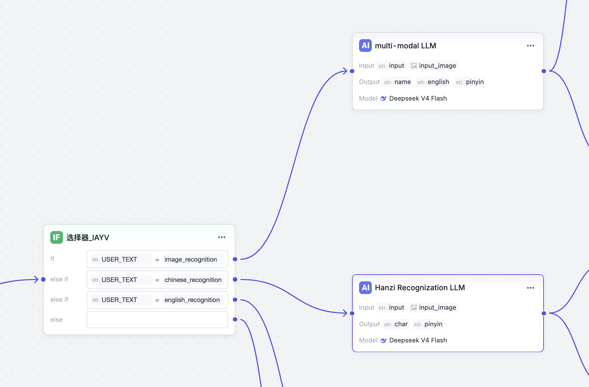
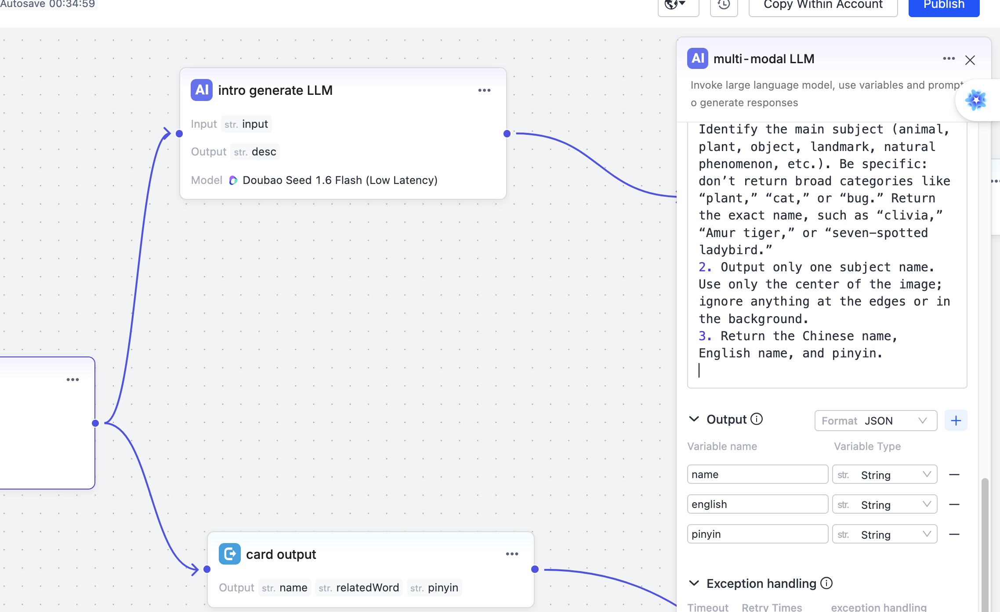
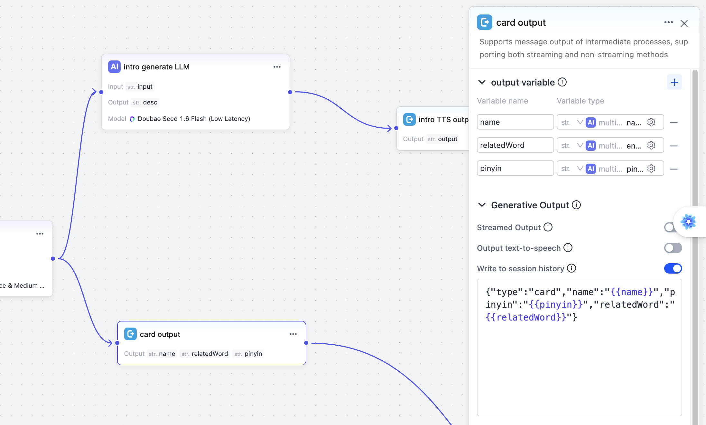

# Create a Workflow

:::note
Before reading this guide, familiarize yourself with agent configuration concepts. See [Create an Agent](https://developer.tuya.com/en/docs/iot/ai-agent-management?id=Kdxr4v7uv4fud).
:::

The default agent configuration primarily supports voice chat. To implement other scenarios, such as image understanding or text-to-image generation, configure the agent through a **workflow** on the Tuya platform. This guide uses an **educational camera** agent as an example of configuring a workflow.

A typical educational camera scenario works as follows: the user presses the camera button, and the device's screen displays information about the detected object, including its pinyin, name, English name, and description. This information is **structured**, but the fields may differ between manufacturers. To implement this feature, create a workflow that outputs `json` containing the fields you need.

## Configure the Workflow {#配置工作流}

When you create a workflow, the canvas already contains Start and End nodes. The Start node includes `USER_TEXT` and `USER_IMAGE`. `USER_TEXT` represents the user's text input: either a text-type message sent through the SDK or text recognized by cloud ASR from an uploaded audio message.

Add a selector here to route requests through different paths, taking multilingual scenarios such as Chinese and English into account.



*The figures in this sequence are schematic guides, not screenshots. They preserve the source workflow's selector tokens and field mappings. The recognition prompt is summarized in English, not reproduced verbatim; current platform UI and model availability have not been verified.*

Next, configure a multimodal LLM node for image recognition. Configure the prompt, inputs (both text and image), and output. The output must use `json` format here.



The JSON produced by the LLM follows two branches:

One branch sends the JSON directly to the device (card output), allowing the device to extract the fields and render them on its screen.



The other branch passes through an LLM again to generate a text description (TTS output), which is then delivered to the device for TTS playback.

## Typical Workflow Structure {#工作流典型结构}

```text
Start (USER_TEXT + USER_IMAGE)
    ├─ Selector: match a branch based on the prompt text
    ├─ Multimodal LLM node: recognize the image and output JSON
    ├─ Card output branch: send the JSON directly to the device
    ├─ TTS output branch: generate a description with the LLM, then perform TTS
    └─ End
```

## Code Development {#代码开发}

```c
// Fixed string matching the value configured in the workflow
const char *prompt     =  "image_recognition";
...
// Send the prompt text to trigger the workflow
stm_ret ret = send_text_prompt(session, "img_understand_001", prompt, 0);
...
// Send the image; set fin to 1 to indicate that packet transmission is complete
ret = send_image(session, NULL, img_data, nread, img_format, 1);
..
// Handle callback events and process the JSON in received text packets
```

When the program runs, this request produces two outputs: structured JSON data and a text string describing the object.

The following is literal example output, with the Chinese strings preserved. The first two lines mean "Data transmission complete" and "Waiting for AI response...". The card's `name` is "Google Chrome icon", and the description begins "Google Chrome is a globally popular web browser developed by Google...".

```
数据发送完毕
等待 AI 响应...
[Text] {"bizId":"img_understand_001","bizType":"NLG","eof":0,"data":{"content":
  "{\"type\":\"card\",\"name\":\"谷歌浏览器图标\",\"pinyin\":\"gu ge liu lan qi tu biao\",
  \"relatedWord\":\"Google Chrome Icon\"}",...}}

[Text] {"bizId":"img_understand_001","bizType":"NLG","eof":0,"data":{"content":
  "谷歌浏览器（Google Chrome）是谷歌公司开发的一款全球流行的网页浏览器...",...}}

[Text] {"bizId":"img_understand_001","bizType":"NLG","eof":1,"data":{"content":"",
  "finish":true,...}}
```

## Related Links {#相关链接}

- [Create an Agent](./create-agent) -- Basic agent configuration steps
- [Image Understanding Tutorial](../tutorials/edu-camera) -- A complete example of sending images from the device
