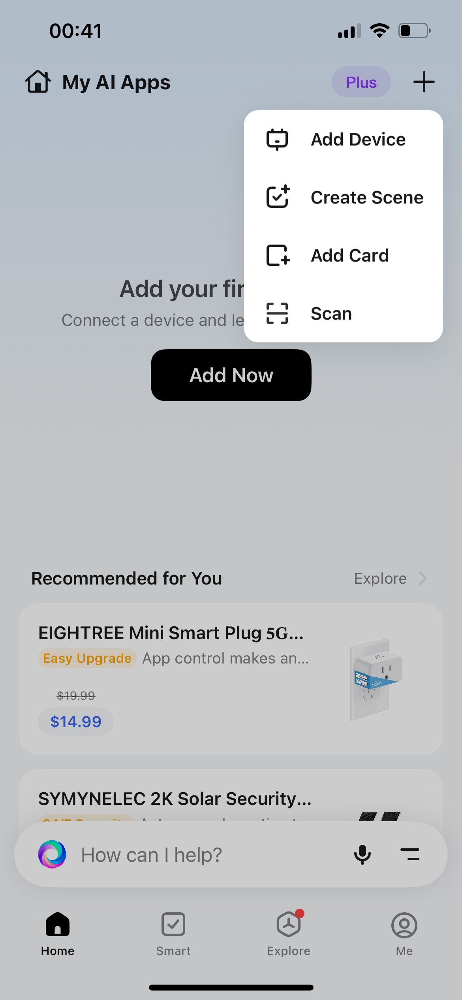
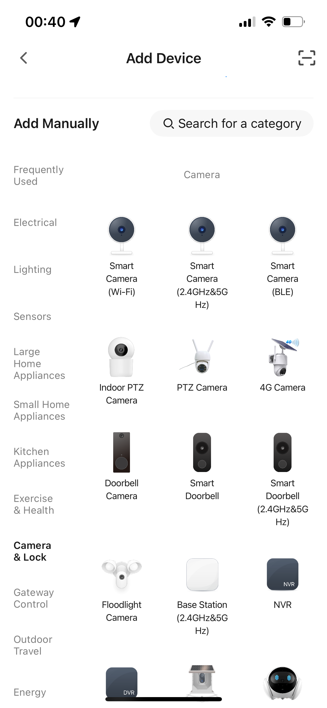
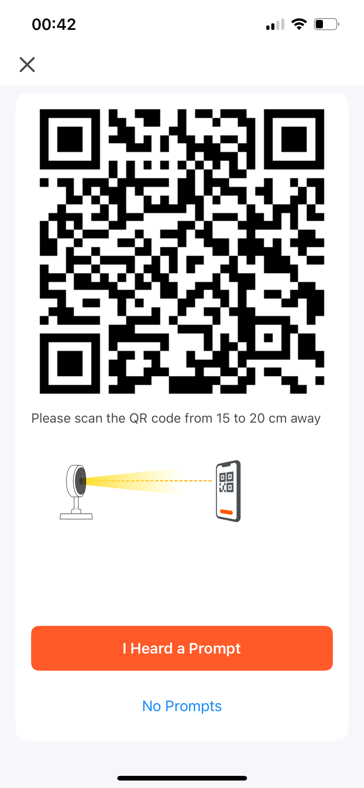

# Device QR Code Provisioning

> Corresponding example: `examples/posix/pair/scan-by-device/`

This chapter describes how to complete the device Provisioning and Activation flow by scanning a QR code generated by the Tuya App.

:::note Prerequisites
Before reading this chapter, make sure you have:
- **Product PID** → obtained after creating a product on the [Tuya IoT Platform](https://iot.tuya.com),
  see [Create and configure an Agent](../guides/create-agent)
- **Device authorization code** (uuid + authkey) → apply for it on the product page of the IoT Platform,
  see step 4 of [Create an Agent](../guides/create-agent)
:::

With this Provisioning method, the device needs a camera so it can scan the QR code generated by the App; if the device
has no camera hardware, this Provisioning method cannot be used.

During the Provisioning flow, the Tuya App generates a QR code containing the WiFi credentials and the Activation Token;
the device scans that QR code with its camera to complete automatic Activation without manual input.

After Activation succeeds, the cloud assigns the device a `devid`, `secret_key`, and `local_key`; all three fields are
required when using `iot_client_init()` and the AI SDK interfaces later.

## App-side steps {#app-侧操作流程}

**Step 1:** On the Tuya App home page, click the **"+"** in the top-right corner and select **"Add Device"**.



*The figures in this sequence are schematic guides, not screenshots. Current English App labels have not been verified. Use the live App for provisioning; no real identifiers, WiFi credentials, Activation Tokens, or scannable QR codes are included here.*

**Step 2:** In the device category list, select the corresponding product category (for example: Camera → Smart Camera
Wi-Fi).



**Step 3:** The App displays a Provisioning QR code and prompts the user to point it at the device camera, keep a distance of
15-20 cm, and wait for the device to beep.



The QR code content is a fixed-format JSON string:

```json
{"s":"<SSID>","p":"<password>","t":"<token>"}
```

where:

| Field | Description |
|------|------|
| `s`  | WiFi SSID |
| `p`  | WiFi password |
| `t`  | Tuya cloud Activation Token (the first two characters encode the Region) |

## Device-side implementation flow {#设备侧实现流程}

```
stbi_load(jpg_path)                          // 1. Decode JPEG -> grayscale pixel buffer
        |
        v
quirc_resize / quirc_begin / quirc_end       // 2. quirc locates and decodes the QR code
quirc_decode()
        |
        v
json_get_str("s") / ("p") / ("t")           // 3. Parse JSON, extract SSID / password / Token
        |
        v
iot_client_init_on_boarding_with_token()     // 4. Activate the device with the Token to obtain credentials such as devid
        |
        v
iot_client_get_session_token()               // 5. Verify cloud connectivity and obtain the AI Session token
        |
        v
iot_client_deinit()                          // 6. Release resources
```

## Key APIs {#关键-api}

### `iot_client_init_on_boarding_with_token()` {#iot_client_init_on_boarding_with_token}

```c
iot_client_t *iot_client_init_on_boarding_with_token(
    const iot_on_boarding_config_t *config,
    const char *token);
```

Skips waiting for MQTT and directly uses a known Token to initiate an Activation request. The Region is automatically
derived from the first two characters of the Token; no manual specification is required.

:::warning MQTT must be connected for the App to judge Provisioning successful
**The App only considers Provisioning successful after it detects that the device has connected to the Tuya cloud MQTT channel (the device is online).**
If you only complete Token Activation and obtain credentials such as `devid` without connecting to MQTT, the App shows Provisioning failed / timed out.

This is therefore now guaranteed by the default behavior—auto-connect is enabled by default with no extra configuration required; as long as you do not set `.mqtt_disable_auto_connect`, the device connects to MQTT automatically after Activation completes:

```c
iot_on_boarding_config_t cfg = {
    // ...
    // Do not set .mqtt_disable_auto_connect: it auto-connects to MQTT by default, which is what lets the App judge Provisioning successful
};
```

Only if the application explicitly sets `.mqtt_disable_auto_connect = true` must it call `iot_client_connect()` manually immediately after Activation succeeds.
:::

**Main `iot_on_boarding_config_t` fields:**

| Field | Description |
|------|------|
| `uuid` | Device UUID (the authorization code applied for from the Tuya IoT Platform) |
| `authkey` | Device Auth Key |
| `product_key` | Product PID |
| `firmware_key` | Firmware Key (may be empty) |
| `timeout_ms` | Activation timeout (milliseconds) |
| `env` | Environment: `PROD` / `PRE` |

**Return value:** On success, returns an `iot_client_t *` that contains the `devid`, `secret_key`, and `local_key` after
Activation, which can be used directly to initialize `iot_client_init()` later; on failure, returns `NULL`.

## Running the example {#运行示例}

```sh
# Use the default arguments (the test authorization code built into the code + res/qr.jpg)
./build/scan_by_device_pair_demo

# Specify arguments
./build/scan_by_device_pair_demo ./res/qr.jpg <uuid> <authkey> <product_key> <firmware_key>
```

> **Note:** Run this from the `examples/posix/` directory so that the default path `res/qr.jpg` resolves correctly.
> The test resource files are located in the `examples/posix/res/` directory.

Example of a successful output:

```
=== scan-by-device pair demo ===
QR image     : res/qr.jpg
UUID         : tuyaXXXXXXXXXXXX
Product key  : p891xbkosae0dgda

[scan_by_device] Image loaded: res/qr.jpg (400x400)
[scan_by_device] QR payload: {"s":"MyWiFi","p":"password123","t":"AY..."}
[scan_by_device] SSID    : MyWiFi
[scan_by_device] Password: password123
[scan_by_device] Token   : AY...
[scan_by_device] Starting on-boarding with token...
[scan_by_device] Activation successful!
[scan_by_device] devid      : <device_id>
[scan_by_device] secret_key : <secret_key>
[scan_by_device] local_key  : <local_key>
[scan_by_device] Session token acquired (len=1234)
```

After Activation succeeds, save the output `devid`, `secret_key`, and `local_key` to the device's persistent
storage and use them directly via `iot_client_init()` later, without repeating Provisioning.

## Notes {#注意事项}

- This example uses `stb_image` to load an image from a file; in a real product, simply replace it with live camera
  frames by writing the pixel data into the buffer returned by `quirc_begin()`.
- The Token is time-limited; after the App displays the QR code, the scan and Activation must be completed within its validity period.
- `firmware_key` can be passed as an empty string in most scenarios.
